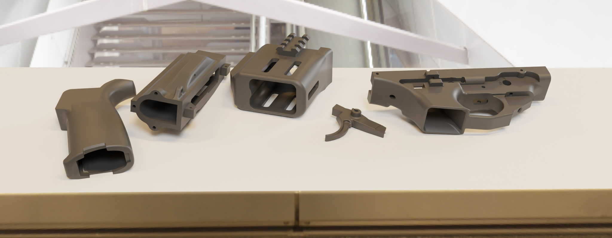
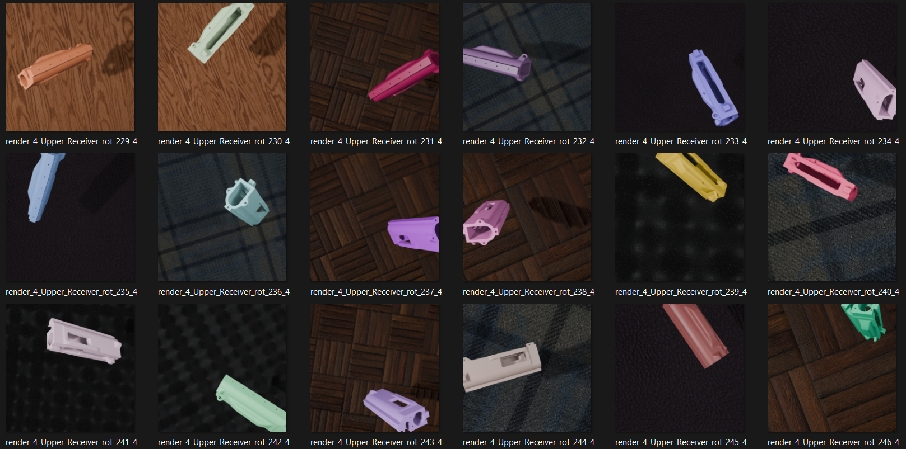
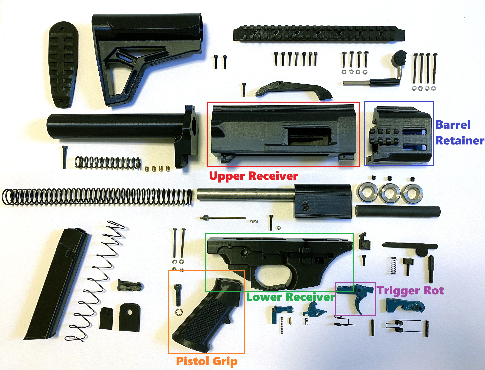
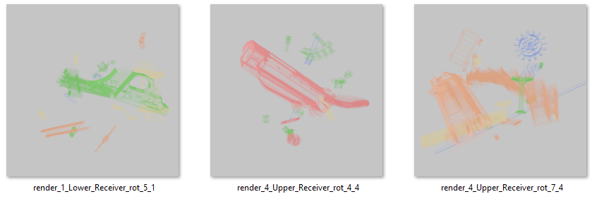
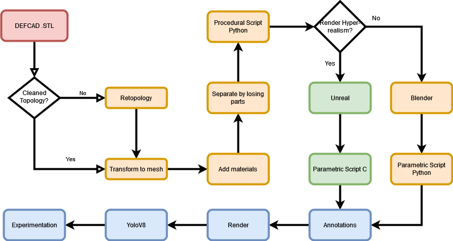

# LEOPARD: Automated CAD-to-Synthetic Pipeline for 3D-Printed Firearm Detection in Civil Transit Security

## Abstract
The proliferation of 3D-printed firearms poses a growing challenge for civil security, particularly in controlled public environments such as airports, train stations, and other transit hubs. These objects are often manufactured from polymer materials, exhibit high design variability, and are difficult to detect using conventional inspection systems. With over 20,000 weapon designs freely available online, traditional dataset creation methods cannot match the pace of design evolution. For this purpose, we present LEOPARD, designed to support civil security applications by converting CAD models of illicit firearm components into large-scale, photorealistic synthetic datasets. The pipeline incorporates procedural geometric variations, material imperfections, and physics-based rendering to realistically model 3D-printed objects as they may appear during security screening. Object detection models trained exclusively on our synthetic data achieve high performance on real 3D-printed components, with AP50 exceeding 83\% and precision reaching up to 91.9\%, demonstrating viable performance without requiring extensive real-world data collection. To encourage further research in automated inspection and public safety, we release LEOPARD-Zero, a dataset of 75,000 fully annotated synthetic images focused on the detection of illegal 3D-printed firearm components in civil transportation security contexts.

## LEOPARD-Dataset 

This sample dataset consists of 1,500 images generated procedurally using a synthetic data pipeline. The images have been automatically annotated following the class definitions introduced in the paper. All annotations are provided in YOLO format. The generation process includes variations in geometry, material properties, and simulated printing artifacts to closely mimic real-world conditions. This subset is intended to support initial experimentation and validation tasks.

You can download the dataset [here](https://uses0-my.sharepoint.com/:u:/g/personal/jaalvarez_us_es/IQCNIp6XMBeGQaU0zpt4omopAUsVKjVfyXOsk8Y28vJKimg?e=kHkHkA){:target="_blank" rel="noopener"}.

<table align="center">
  <tr>
      
  </tr>
  <tr>
    <td align="center">
      
    </td>
    <td align="center">
      
    </td>
  </tr>
  <tr>
    <td align="center">
      
    </td>
    <td align="center">
      
    </td>
  </tr>
</table>

## Terms of use
This subset can be used for academic research free of charge, citing the paper as we explain below. If you seek to use the data for commercial purposes please or gain access to the full dataset [contact us](mailto:jaalvarez@us.es).

## Citation
If you use our dataset, please kindly cite the following paper: coming soon.

This work is licensed under a
[Creative Commons Attribution-NonCommercial 4.0 International License][cc-by-nc]. Contact the authors of this work for commercial use. 

[![CC BY NC 4.0][cc-by-nc-image]][cc-by-nc]

[cc-by-nc]: http://creativecommons.org/licenses/by-nc/4.0/
[cc-by-nc-image]: https://i.creativecommons.org/l/by-nc/4.0/88x31.png
